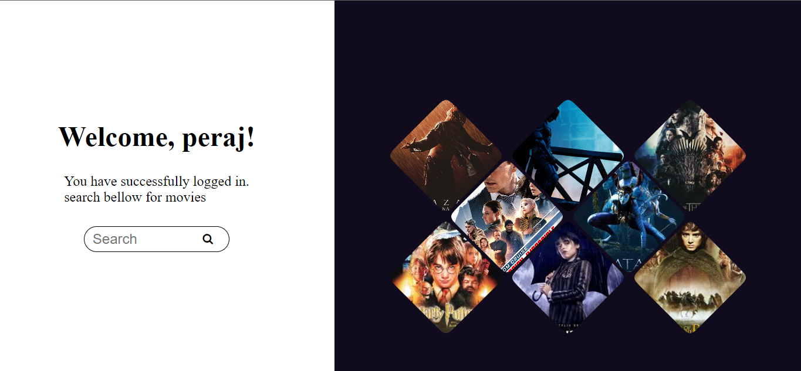

# 🎬 Movie Review Application 🍿

This project is a Movie Review Application that allows users to sign up, log in, and search for movie reviews. It uses authentication and data storage with Google Firestore and retrieves movie information via the OMDb API.

## ✨ Features

- **User Authentication:** Users can sign up and log in with their email and password. User information is securely stored in Google Firestore.
- **Dashboard:** Once authenticated, users are taken to a dashboard displaying top movies and a search bar. 
- **Movie Search:** Users can search for movies, and the app displays reviews and information fetched from the OMDb API.
- **Responsive Design:** The application is designed to be user-friendly and responsive.

## 🚀 Getting Started

### Prerequisites

- Ensure you have Node.js and npm installed on your system.

### Installation

1. **Clone the Repository:**
    ```bash
    git clone https://github.com/pavanreddy565/Movie_review_application.git
    ```

2. **Navigate to Project Directory:**
    ```bash
    cd Movie_review_application
    ```

3. **Initialize npm:**
    ```bash
    npm init -y
    ```

4. **Install Dependencies:**
    ```bash
    npm install express
    npm install body-parser
    npm install firebase-admin
    npm install ejs
    npm install request
    npm install nodemon -g
    ```

5. **Start the Server:**
    ```bash
    nodemon server.js
    ```

### Configuration

- Make sure to include the `serviceAccountKey.json` file from Google Firestore in the root directory of the project for Firebase authentication and Firestore access.

## 📷 Dashboard

Here is an image of the dashboard for reference:



## 📡 API

This application uses the [OMDb API](http://www.omdbapi.com) to fetch movie reviews and information.

## 🛠️ Powered By

- **EJS View Engine:** For rendering dynamic web pages.
- **Express:** Fast, unopinionated, minimalist web framework for Node.js.

## 🤝 Contributing

Contributions are welcome! Feel free to submit a pull request or open an issue to improve the project.

## 📄 License

This project is licensed under the MIT License. See the [LICENSE](LICENSE) file for details.

---

Happy coding! 🎉
